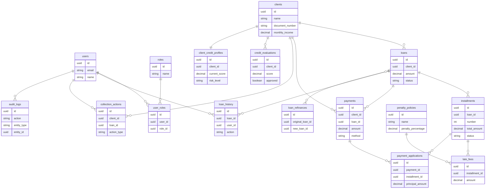

# Diseño de base de datos – CashUp API

Diseño derivado de las **entidades de dominio** actuales. Convenciones: tablas en **snake_case**, claves primarias **UUID**, fechas **TIMESTAMP**, montos **DECIMAL**, datos estructurados **JSONB**.

---

## 1. IAM / Users

### `users`
| Columna        | Tipo         | Restricción | Descripción                |
|----------------|--------------|-------------|----------------------------|
| id             | UUID         | PK          | Identificador              |
| email          | VARCHAR(255) | UNIQUE, NOT NULL | Correo del usuario   |
| name           | VARCHAR(255) | NOT NULL    | Nombre                     |
| password_hash  | VARCHAR(255) | NOT NULL    | Hash de contraseña         |
| is_active      | BOOLEAN      | NOT NULL, DEFAULT true | Activo/desactivado |
| created_at     | TIMESTAMP    | NOT NULL    | Alta                       |
| updated_at     | TIMESTAMP    | NOT NULL    | Última actualización       |

### `roles`
| Columna        | Tipo         | Restricción | Descripción                |
|----------------|--------------|-------------|----------------------------|
| id             | UUID         | PK          | Identificador              |
| name           | VARCHAR(100) | NOT NULL    | Nombre del rol             |
| description    | TEXT         | NULL        | Descripción                |
| created_at     | TIMESTAMP    | NOT NULL    | Alta                       |
| updated_at     | TIMESTAMP    | NOT NULL    | Última actualización       |

### `user_roles`
| Columna        | Tipo         | Restricción | Descripción                |
|----------------|--------------|-------------|----------------------------|
| id             | UUID         | PK          | Identificador              |
| user_id        | UUID         | FK → users, NOT NULL | Usuario        |
| role_id        | UUID         | FK → roles, NOT NULL | Rol            |
| assigned_at    | TIMESTAMP    | NOT NULL    | Fecha de asignación        |

---

## 2. Risk & Scoring (cliente primero por dependencias)

### `clients`
| Columna           | Tipo         | Restricción | Descripción                |
|-------------------|--------------|-------------|----------------------------|
| id                | UUID         | PK          | Identificador              |
| document_type     | VARCHAR(50)  | NOT NULL    | Tipo de documento          |
| document_number   | VARCHAR(50)  | NOT NULL    | Número de documento        |
| name              | VARCHAR(255) | NOT NULL    | Nombre completo            |
| email             | VARCHAR(255) | NULL        | Correo                     |
| phone             | VARCHAR(50)  | NULL        | Teléfono                   |
| monthly_income    | DECIMAL(15,2)| NOT NULL    | Ingreso mensual            |
| created_at        | TIMESTAMP    | NOT NULL    | Alta                       |
| updated_at        | TIMESTAMP    | NOT NULL    | Última actualización       |

### `credit_evaluations`
| Columna             | Tipo         | Restricción | Descripción                |
|---------------------|--------------|-------------|----------------------------|
| id                  | UUID         | PK          | Identificador              |
| client_id            | UUID         | FK → clients, NOT NULL | Cliente      |
| score               | DECIMAL(5,2) | NOT NULL    | Puntaje                    |
| approved            | BOOLEAN      | NOT NULL    | Aprobado / rechazado       |
| factors             | JSONB        | NOT NULL    | Factores de evaluación     |
| evaluated_at        | TIMESTAMP    | NOT NULL    | Fecha de evaluación        |
| evaluated_by_user_id | UUID         | FK → users, NULL | Usuario que evaluó   |

### `credit_score_history`
| Columna     | Tipo         | Restricción | Descripción                |
|-------------|--------------|-------------|----------------------------|
| id          | UUID         | PK          | Identificador              |
| client_id   | UUID         | FK → clients, NOT NULL | Cliente      |
| score       | DECIMAL(5,2) | NOT NULL    | Puntaje en ese momento     |
| recorded_at | TIMESTAMP    | NOT NULL    | Fecha del registro         |

### `client_background_checks`
| Columna     | Tipo         | Restricción | Descripción                |
|-------------|--------------|-------------|----------------------------|
| id          | UUID         | PK          | Identificador              |
| client_id   | UUID         | FK → clients, NOT NULL | Cliente      |
| type        | VARCHAR(100) | NOT NULL    | Tipo de verificación       |
| result      | VARCHAR(100) | NOT NULL    | Resultado                  |
| details     | TEXT         | NULL        | Detalles                   |
| checked_at  | TIMESTAMP    | NOT NULL    | Fecha de verificación      |

### `external_debts`
| Columna          | Tipo         | Restricción | Descripción                |
|------------------|--------------|-------------|----------------------------|
| id               | UUID         | PK          | Identificador              |
| client_id        | UUID         | FK → clients, NOT NULL | Cliente      |
| creditor_name    | VARCHAR(255) | NOT NULL    | Nombre del acreedor        |
| amount           | DECIMAL(15,2)| NOT NULL    | Monto de la deuda          |
| monthly_payment  | DECIMAL(15,2)| NOT NULL    | Cuota mensual              |
| recorded_at      | TIMESTAMP    | NOT NULL    | Fecha de registro          |

### `client_credit_profiles`
| Columna               | Tipo         | Restricción | Descripción                |
|-----------------------|--------------|-------------|----------------------------|
| id                    | UUID         | PK          | Identificador              |
| client_id             | UUID         | FK → clients, UNIQUE, NOT NULL | Un perfil por cliente |
| current_score         | DECIMAL(5,2) | NOT NULL    | Puntaje actual             |
| risk_level            | VARCHAR(50)  | NOT NULL    | Nivel de riesgo           |
| total_debt            | DECIMAL(15,2)| NOT NULL    | Deuda total                |
| on_time_payments_count| INT          | NOT NULL    | Pagos a tiempo             |
| late_payments_count   | INT          | NOT NULL    | Pagos atrasados            |
| updated_at            | TIMESTAMP    | NOT NULL    | Última actualización       |

---

## 3. Credit Management

### `penalty_policies`
| Columna             | Tipo         | Restricción | Descripción                |
|---------------------|--------------|-------------|----------------------------|
| id                  | UUID         | PK          | Identificador              |
| name                | VARCHAR(100) | NOT NULL    | Nombre de la política      |
| penalty_percentage  | DECIMAL(5,2) | NOT NULL    | Porcentaje de mora         |
| grace_days          | INT          | NOT NULL    | Días de gracia             |
| calculation_type    | VARCHAR(50)  | NOT NULL    | Tipo de cálculo            |
| is_active           | BOOLEAN      | NOT NULL    | Activa o no                |
| created_at          | TIMESTAMP    | NOT NULL    | Alta                       |
| updated_at          | TIMESTAMP    | NOT NULL    | Última actualización       |

### `loans`
| Columna        | Tipo         | Restricción | Descripción                |
|----------------|--------------|-------------|----------------------------|
| id             | UUID         | PK          | Identificador              |
| client_id      | UUID         | FK → clients, NOT NULL | Cliente      |
| amount         | DECIMAL(15,2)| NOT NULL    | Monto del préstamo         |
| interest_rate  | DECIMAL(5,2) | NOT NULL    | Tasa de interés            |
| term_months    | INT          | NOT NULL    | Plazo en meses             |
| interest_type  | VARCHAR(50)  | NOT NULL    | Tipo de interés            |
| status         | VARCHAR(30)  | NOT NULL    | pending_approval, approved, rejected, disbursed, refinanced, closed |
| created_at     | TIMESTAMP    | NOT NULL    | Alta                       |
| updated_at     | TIMESTAMP    | NOT NULL    | Última actualización       |

### `loan_refinances`
| Columna           | Tipo     | Restricción | Descripción                |
|-------------------|----------|-------------|----------------------------|
| id                | UUID     | PK          | Identificador              |
| original_loan_id   | UUID     | FK → loans, NOT NULL | Préstamo original   |
| new_loan_id       | UUID     | FK → loans, NOT NULL | Préstamo nuevo     |
| refinanced_at     | TIMESTAMP| NOT NULL    | Fecha de refinanciamiento  |

### `installments`
| Columna           | Tipo         | Restricción | Descripción                |
|-------------------|--------------|-------------|----------------------------|
| id                | UUID         | PK          | Identificador              |
| loan_id           | UUID         | FK → loans, NOT NULL | Préstamo        |
| number            | INT          | NOT NULL    | Número de cuota            |
| due_date          | DATE         | NOT NULL    | Fecha de vencimiento       |
| principal_amount  | DECIMAL(15,2)| NOT NULL    | Amortización               |
| interest_amount   | DECIMAL(15,2)| NOT NULL    | Interés                    |
| total_amount      | DECIMAL(15,2)| NOT NULL    | Total de la cuota          |
| status            | VARCHAR(20)  | NOT NULL    | pending, partial, paid, overdue |
| paid_at           | TIMESTAMP    | NULL        | Fecha de pago              |
| created_at        | TIMESTAMP    | NOT NULL    | Alta                       |
| updated_at        | TIMESTAMP    | NOT NULL    | Última actualización       |

### `loan_charges`
| Columna     | Tipo         | Restricción | Descripción                |
|-------------|--------------|-------------|----------------------------|
| id          | UUID         | PK          | Identificador              |
| loan_id     | UUID         | FK → loans, NOT NULL | Préstamo        |
| type        | VARCHAR(50)  | NOT NULL    | Tipo (comisión, seguro…)   |
| amount      | DECIMAL(15,2)| NOT NULL    | Monto                      |
| description | TEXT         | NULL        | Descripción                |
| created_at  | TIMESTAMP    | NOT NULL    | Alta                       |

### `late_fees`
| Columna             | Tipo         | Restricción | Descripción                |
|---------------------|--------------|-------------|----------------------------|
| id                  | UUID         | PK          | Identificador              |
| installment_id      | UUID         | FK → installments, NOT NULL | Cuota    |
| amount              | DECIMAL(15,2)| NOT NULL    | Monto de la penalidad     |
| applied_at          | TIMESTAMP    | NOT NULL    | Fecha de aplicación       |
| penalty_policy_id   | UUID         | FK → penalty_policies, NOT NULL | Política usada |

### `loan_history`
| Columna        | Tipo     | Restricción | Descripción                |
|----------------|----------|-------------|----------------------------|
| id             | UUID     | PK          | Identificador              |
| loan_id        | UUID     | FK → loans, NOT NULL | Préstamo        |
| action         | VARCHAR(100)| NOT NULL   | Acción registrada          |
| previous_state | JSONB    | NULL        | Estado anterior            |
| new_state      | JSONB    | NULL        | Estado nuevo               |
| user_id        | UUID     | FK → users, NOT NULL | Usuario que actuó |
| created_at     | TIMESTAMP| NOT NULL    | Fecha del evento           |

---

## 4. Payments

### `payments`
| Columna     | Tipo         | Restricción | Descripción                |
|-------------|--------------|-------------|----------------------------|
| id          | UUID         | PK          | Identificador              |
| client_id   | UUID         | FK → clients, NOT NULL | Cliente      |
| loan_id     | UUID         | FK → loans, NOT NULL | Préstamo        |
| amount      | DECIMAL(15,2)| NOT NULL    | Monto pagado               |
| method      | VARCHAR(50)  | NOT NULL    | Método de pago             |
| reference   | VARCHAR(255) | NULL        | Referencia externa         |
| paid_at     | TIMESTAMP    | NOT NULL    | Fecha del pago             |
| created_at  | TIMESTAMP    | NOT NULL    | Alta                       |

### `payment_applications`
| Columna           | Tipo         | Restricción | Descripción                |
|-------------------|--------------|-------------|----------------------------|
| id                | UUID         | PK          | Identificador              |
| payment_id        | UUID         | FK → payments, NOT NULL | Pago      |
| installment_id    | UUID         | FK → installments, NOT NULL | Cuota    |
| principal_amount  | DECIMAL(15,2)| NOT NULL    | Aplicado a principal       |
| interest_amount   | DECIMAL(15,2)| NOT NULL    | Aplicado a interés         |
| late_fee_amount   | DECIMAL(15,2)| NOT NULL    | Aplicado a mora            |
| applied_at        | TIMESTAMP    | NOT NULL    | Fecha de aplicación        |

---

## 5. Collection / Debt Recovery

### `collection_actions`
| Columna             | Tipo         | Restricción | Descripción                |
|---------------------|--------------|-------------|----------------------------|
| id                  | UUID         | PK          | Identificador              |
| client_id           | UUID         | FK → clients, NOT NULL | Cliente      |
| loan_id             | UUID         | FK → loans, NULL | Préstamo (opcional)   |
| action_type         | VARCHAR(50)  | NOT NULL    | Tipo de gestión           |
| result              | VARCHAR(100) | NOT NULL    | Resultado                  |
| notes               | TEXT         | NULL        | Notas                      |
| performed_at        | TIMESTAMP    | NOT NULL    | Fecha de la gestión        |
| performed_by_user_id| UUID         | FK → users, NOT NULL | Usuario que realizó |

---

## 6. Audit

### `audit_logs`
| Columna     | Tipo     | Restricción | Descripción                |
|-------------|----------|-------------|----------------------------|
| id          | UUID     | PK          | Identificador              |
| action      | VARCHAR(100)| NOT NULL  | Acción (ej. login, update) |
| entity_type | VARCHAR(100)| NOT NULL  | Tipo de entidad            |
| entity_id   | UUID     | NOT NULL    | ID de la entidad           |
| old_values  | JSONB    | NULL        | Valores anteriores         |
| new_values  | JSONB    | NULL        | Valores nuevos             |
| user_id     | UUID     | FK → users, NULL | Usuario (si aplica)   |
| ip          | VARCHAR(45)| NULL       | IP                         |
| user_agent  | TEXT     | NULL        | User-Agent                 |
| created_at  | TIMESTAMP| NOT NULL    | Fecha del evento           |

---

## Diagrama de relaciones (gráfico)

Puedes ver el diagrama en [Mermaid Live](https://mermaid.live/) pegando el contenido de `md/diagrama-bd-simple.mmd`, o en GitHub/VS Code si tienen soporte Mermaid.



---

## Diagrama de relaciones (resumen en texto)

```
users ◄──┬── user_roles ──► roles
          ├── loan_history
          ├── credit_evaluations.evaluated_by_user_id
          ├── collection_actions.performed_by_user_id
          └── audit_logs.user_id

clients ◄──┬── loans
           ├── credit_evaluations
           ├── credit_score_history
           ├── client_background_checks
           ├── external_debts
           ├── client_credit_profiles
           ├── payments
           └── collection_actions

loans ◄──┬── loan_refinances (original_loan_id, new_loan_id)
         ├── installments
         ├── loan_charges
         ├── loan_history
         ├── payments
         └── collection_actions (opcional)

installments ◄──┬── late_fees
                └── payment_applications

penalty_policies ◄── late_fees

payments ◄── payment_applications
```

---

## Resumen por contexto

| Contexto          | Tablas                                                                 |
|-------------------|------------------------------------------------------------------------|
| IAM               | users, roles, user_roles                                               |
| Risk & Scoring    | clients, credit_evaluations, credit_score_history, client_background_checks, external_debts, client_credit_profiles |
| Credit Management | penalty_policies, loans, loan_refinances, installments, loan_charges, late_fees, loan_history |
| Payments          | payments, payment_applications                                         |
| Collection        | collection_actions                                                     |
| Audit             | audit_logs                                                             |

**Total: 20 tablas.**

Este diseño refleja las entidades actuales del dominio; al añadir persistencia (p. ej. TypeORM o Prisma) se pueden generar migraciones a partir de estas definiciones.
